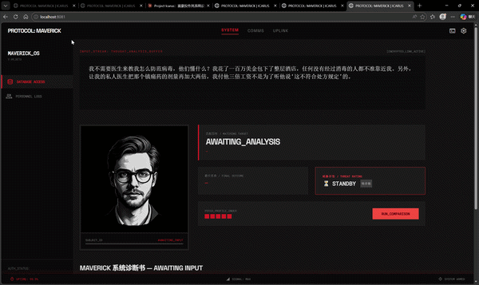

# Project Icarus — 伊卡洛斯审判官

> 100% 本地运行的 RAG 商业避险侧写系统。输入你的创业想法，接受死亡判决。


---

## Demo



---

## What is this?

Project Icarus 是一个全栈 RAG（检索增强生成）系统。它维护了一个经过深度清洗的商业失败案例向量数据库，当用户输入一段创业想法时，系统会：

1. 将输入向量化，从 55 个真实商业失败案例中检索最相似的死亡模式
2. 将检索到的案例作为上下文注入本地 LLM
3. 生成一份冷血的认知偏差诊断书 —— 包含偏差锁定、死亡判例、镜像审判和最终裁决

零远程 API 调用。零数据泄露。全部在你的 GPU 上完成。

---

## Architecture

```
[User Input: 创业想法]
        │
        ▼ (POST /api/analyze)
[FastAPI Backend] ─── api_server.py
        │
        ▼
[Embedding: nomic-embed-text] ──► Vectorization (Ollama Local)
        │
        ▼
[Retrieval: ChromaDB] ──────────► Semantic Search (Top-K)
        │
        ▼ (Context-Aware Prompt Assembly)
[Generation: Qwen2.5:14b] ─────► Local LLM Inference (Ollama)
        │
        ▼ (Structured JSON Response)
[Frontend UI: HTML/JS + Tailwind] ──► Threat Rating + Typewriter Rendering
```

---

## Tech Stack

| Layer | Technology |
|-------|-----------|
| Backend | Python, FastAPI, Uvicorn |
| Vector DB | ChromaDB (Local SQLite) |
| Embedding | nomic-embed-text (Ollama) |
| LLM | Qwen2.5:14b (Ollama) |
| Frontend | Vanilla JS, HTML5, Tailwind CSS |
| Hardware | RTX 5080 16GB VRAM |

---

## Local Setup

### Prerequisites

- Python 3.10+
- [Ollama](https://ollama.com) installed and running
- GPU with 16GB+ VRAM (recommended)

### 1. Clone & Install

```bash
git clone https://github.com/hyang1490-jpg/Maverick_RAG_Framework.git
cd Maverick_RAG_Framework
pip install -r requirements.txt
```

### 2. Pull Models

```bash
ollama pull qwen2.5:14b
ollama pull nomic-embed-text
```

### 3. Initialize Vector Database

```bash
python ingest_v2.py
```

This loads `icarus_cleansed_db_v3.json` (55 curated failure cases) into ChromaDB.

### 4. Start Backend

```bash
python api_server.py
```

Server runs at `http://localhost:8000`. Verify: `GET /api/health`

### 5. Open Frontend

Open `index.html` in your browser. Input a startup idea. Face the judgment.

---

## Data Pipeline

原始数据经过多轮清洗重铸，最终产出 `icarus_cleansed_db_v3.json`：

- **industry**: 中文行业标签（食品科技、社交媒体、电商等）
- **failure_reasons**: 中文深度死因分析（由 Qwen2.5:14b 本地生成）
- **funding_amount**: 真实融资金额（交叉验证，含 $ 符号）
- **archetype**: 认知偏差原型（Icarus Syndrome, Sunk Cost Fallacy, Cargo Cult 等）

---

## Version History

| Version | Milestone |
|---------|-----------|
| **v1.0** | CLI MVP — ChromaDB + Ollama 命令行检索与生成 |
| **v2.0** | Full-Stack — FastAPI 中间层 + 赛博朋克 Web UI + 前后端联通 |

---

## Roadmap

- [ ] 扩库至 200+ 失败案例
- [ ] SSE 流式前端渲染（`/api/judge` 端点已就绪）
- [ ] 多案例对比分析
- [ ] 认知偏差雷达图可视化

---

## License

MIT